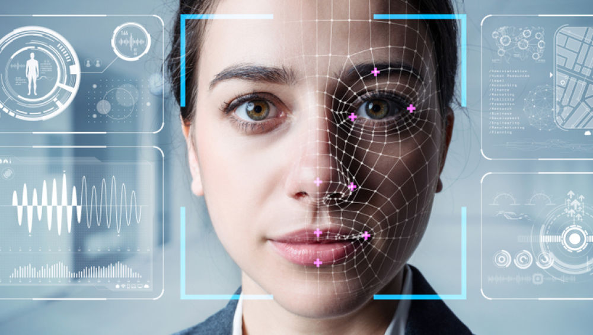

  <body style="background-color:#708090;">
</body>

---
---
# **Reconocimiento Facial**

## **Proyecto realizado por la clase de Data Science de The Bridge-Sevilla como Desafío de Tripulaciones**

---
- [**Índice del Proyecto**](#indice-del-proyecto)
  1. [**Descripción**](#descripción)
  2. [**Seguridad**](#seguridad)
  3. [**Proceso de recopilación y clasificación de imagenes**](#proceso-de-recopilación-y-clasificación-de-imagenes)
  4. [**Modelo Predictivo**](#modelo-predictivo)
  5. [**Validación del modelo y conclusiones finales**](#validación-del-modelo-y-conclusiones-finales)
  6. [**Miembros del equipo de desarrollo**](#miembros-del-equipo-de-desarrollo)
---
<!-- TOC -->
---
### **Descripción** 
Como proyecto final de curso, en la clase de Data Science de The Bridge-Sevilla hemos elaborado un prototipo de una App de seguridad de reconocimiento facial que usa el método de Eigenfaces, que consiste en la recopilación, almacenamiento y detección facial, para una posterior inclusión en un sitio web, dispostivos móviles u ordenadores. 

Para elaborar dicho prototipo hemos utilizado Python y sus diferentes librerías. También hemos creado una base de datos usando videos de ejemplo de nuestras propios rostros y sacando capturas frame a frame.  
---
## **Seguridad**
Para asegurar que nuestro prototipo es seguro, hemos creado un sistema de seguridad de 3 capas o layers. El primero es la propia cara del usuario, el segundo es la asociación de esa cara a un usuario dentro de la base de datos de la App y la tercera es un pin del usuario dentro de la msima App.
---
### **Proceso de recopilación y clasificación de imagenes**
Lo primero es crear una lista de etiquetas de personas y números de datos, relacionando ambas categorías entre sí. También hacemos un data generator para generar datos adicionales que podamos usar posteriormente en nuestro modelo.

Tras esto, los primero que hace nuestra App es detectar el objeto "cara" mediante video, procesando las imagenes del video frame a frame y obteniendo datos a partir de dichas imagenes. 
---
### **Modelo Predictivo**
El modelo le hace un PCA a todas las fotos de manera individual, lo que nos permite simplificar la complejidad de espacios muestrales con muchas dimensiones a la vez que conserva toda la información. 

Para nuestro caso en concreto hemos utilizado el modelo Eigenface, que da algunos fallos cuando la cámara no capta nuestro rostro de manera frontal, pero a su vez, no genera falsos positivos, lo cual es crucial para una App de seguridad. 

---
### **Validación del modelo y conclusiones finales**
---
### **Miembros del equipo de desarrollo**
| Nombre | Email | LinkedIn | GitHub |
|--------|-------|----------|--------|
|   Mario Chacon Ruiz     |  mario.chaconruiz93@gmail.com     |   https://www.linkedin.com/in/mario-chacon-ruiz-data-scientist/       |   https://github.com/MarioChackGitHub     |
|   Ouissam Fechtali Othman    |       |          |        |
|   Jose Luis Torres Andrades   |       |          |        |
|   Francisco Javier Ruiz Guerra     |       |          |        |
|   Daniel Soria Martinez     |       |          |        |
|   Jose Enrique Vera Rodriguez      |  kikewnguitar@gmail.com     |  https://www.linkedin.com/in/jose-enrique-vera/        |   https://github.com/kike272     |

